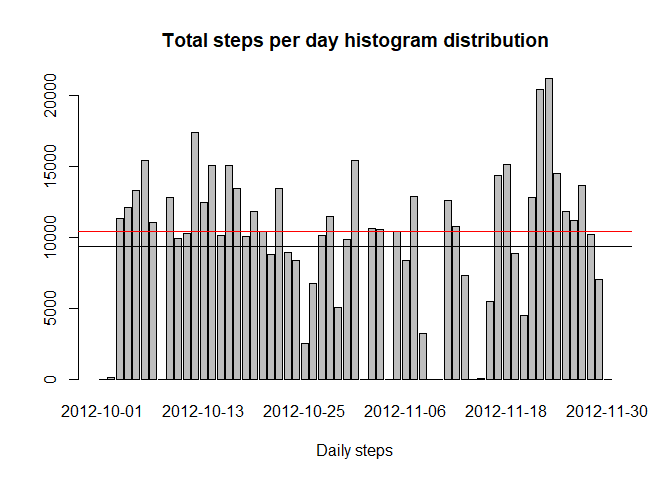
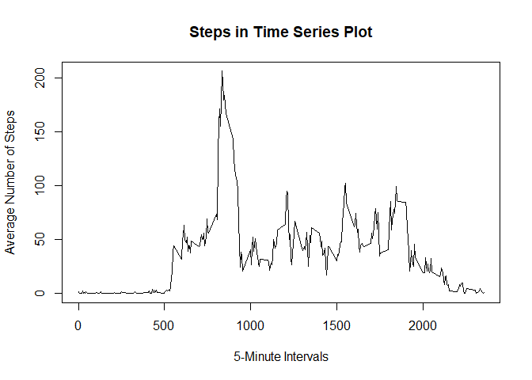
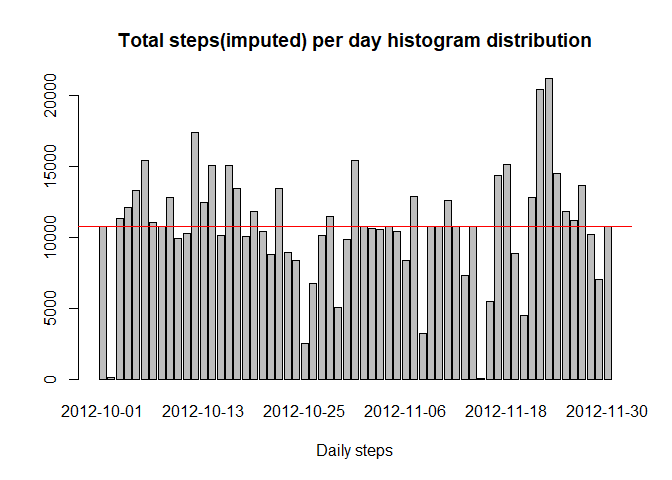
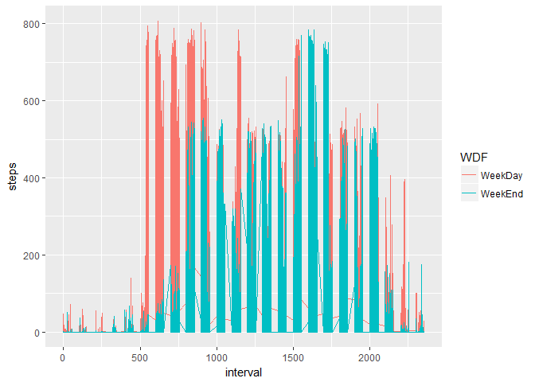

# Peer Assessment 1 for Reproducible Research
Emre  
2017 M10 8  


## Loading and preprocessing the data

This is to downlaod "data.zip"and extract "activity.csv" if not available  
Read data from file  
Convert string format to date  


```r
csvFile <- "activity.csv"
if( !file.exists(csvFile) ){
  zipFile <- "data.zip"
  # Download if not exists
  if( !file.exists(zipFile) ){
    download.file("https://github.com/emrsen/RepData_PeerAssessment1/blob/master/activity.zip", destfile = zipFile)
  }
  # Extract zip
  unzip(zipFile, exdir = ".") 
}

# Read data from file
df <- read.csv(csvFile, stringsAsFactors = F)
# Covert string to date format
df$date2 <- as.Date(df$date,"%Y-%m-%d")
```

## What is mean total number of steps taken per day?

Calculating daily sum of the steps


```r
# Calculate daily sum of steps
stepsday<-tapply(df$steps, df$date2, FUN=sum, na.rm=TRUE)
#Plot histogram for the daily sum of the steps
barplot(stepsday,main = "Total steps per day histogram distribution",xlab = "Daily steps")
abline(h=mean(stepsday))
abline(h=median(stepsday), col="red")
```

<!-- -->

```r
#Calculate mean of daily sum of steps black line
mean(stepsday)
```

```
## [1] 9354.23
```

```r
#Calculate median of daily sum of steps red line
median(stepsday)
```

```
## [1] 10395
```

## What is the average daily activity pattern?

Graphing average daily activity pattern interval basis


```r
#Calculate average steps for each inteval
stepsmeanint <- tapply(df$steps, df$interval, FUN = mean, na.rm = TRUE)
#Plot graph for the average steps
plot(names(stepsmeanint),stepsmeanint, type = "l", main = "Steps in Time Series Plot", xlab = "5-Minute Intervals", ylab = "Average Number of Steps")
```

<!-- -->

```r
#maximum average steps for the time of the day 5 minute interval
as.numeric(names(which.max(stepsmeanint)))
```

```
## [1] 835
```

```r
#maximum average steps values
max(stepsmeanint)
```

```
## [1] 206.1698
```

## Imputing missing values

Replacing missing values using calculated average mean of each steps


```r
#create subset of missing steps
dfna <- df[which(is.na(df$steps)),]
#create a new copy of the data frame df
df_imputed <- df
# Replace missing steps in the new imputed data frame with the calculated missing steps
df_imputed$steps[is.na(df$steps)] <- stepsmeanint[as.character(dfna$interval)]
# Calculate daily sum of imputed steps
stepsday_imp<-tapply(df_imputed$steps, df_imputed$date2, FUN=sum, na.rm=TRUE)
# Plot histogram for the daily sum of the steps
barplot(stepsday_imp,main = "Total steps(imputed) per day histogram distribution",xlab = "Daily steps")
abline(h=mean(stepsday_imp))
abline(h=median(stepsday_imp), col="red")
```

<!-- -->

```r
# Calculate mean of daily sum of imputed steps black line
mean(stepsday_imp)
```

```
## [1] 10766.19
```

```r
# Calculate median of daily sum of imputed steps red line
median(stepsday_imp)
```

```
## [1] 10766.19
```

```r
# Mean and median value increased and equalised. 
# After imputing the missing values with average daily values
```

## Are there differences in activity patterns between weekdays and weekends?

Displaying weekdays and weekends patterns


```r
#Adding weekday info to the imputed data
df_imputed$WD <- weekdays(df_imputed$date2)
#Adding Weekday or weekend info
df_imputed$WDF <- ifelse(df_imputed$WD %in% c("Monday","Tuesday","Wednesday","Thursday","Friday"), "WeekDay", "WeekEnd")
#Comparale graphics in ggplot
library(ggplot2)
```

```
## Warning: package 'ggplot2' was built under R version 3.4.1
```

```r
ggplot(df_imputed, aes(x=interval, y=steps, color=WDF)) + geom_line()
```

<!-- -->
  
Weekdays people walk more early morning hours  
Weekends people walk more in afternoon hours
